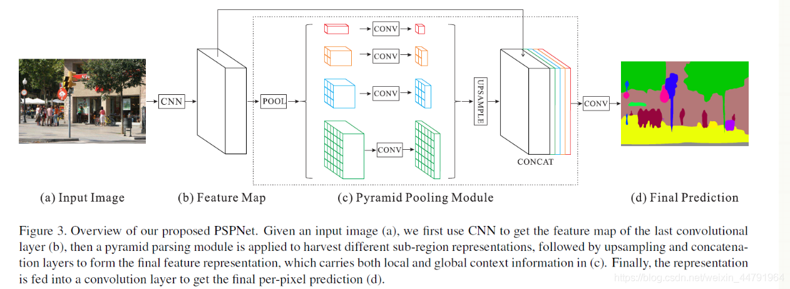
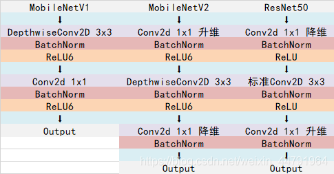
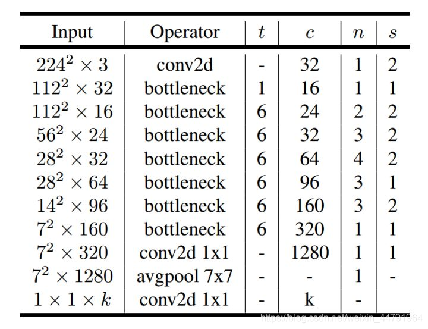
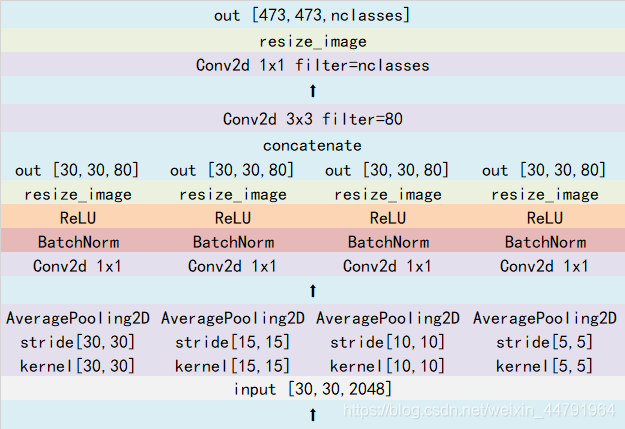
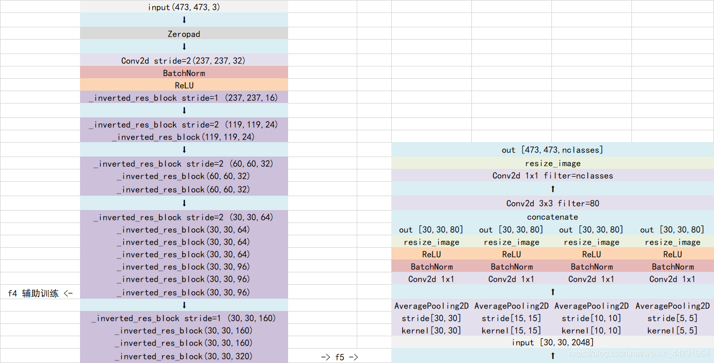
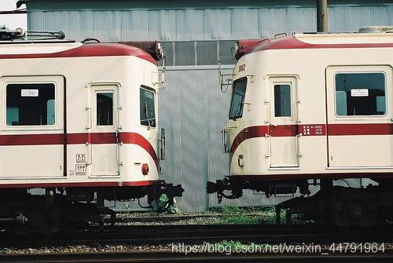

# 什么是PSPNet模型

PSPNet模型最主要的特点**是采用了PSP模块。**

该模型**提出的金字塔池化模块(Pyramid Pooling Module)能够聚合不同区域的上下文信息，从而提高获取全局信息的能力**。实验表明这样的先验表示(即指代PSP这个结构)是有效的，在多个数据集上展现了优良的效果。

PSP结构的功能是将**获取到的特征层划分成不同大小的网格，每个网格内部各自进行平均池化**。实现聚合不同区域的上下文信息，从而提高获取全局信息的能力。

在PSPNet中，**PSP结构典型情况下，会将输入进来的特征层划分成6x6，3x3，2x2，1x1的网格，对应了图片中的绿色、蓝色、橙色、红色的的输出**：



其中：

红色：将输入进来的特征层整个进行平均池化。
橙色：将输入进来的特征层划分为2×2个子区域，然后对每个子区域进行平均池化。
蓝色：将输入进来的特征层划分为3×3个子区域，然后对每个子区域进行平均池化。
绿色：将输入进来的特征层划分为6×6个子区域，然后对每个子区域进行平均池化。

# 代码下载

Github源码下载地址为：

https://github.com/bubbliiiing/pspnet-pytorch

# PSPNet实现思路

## 一、预测部分

### 1、主干网络介绍


PSPNet在**论文中采用的是Resnet系列作为主干特征提取网络**，本博客会给大家提供两个主干网络，分别是resnet50和mobilenetv2。

但是由于算力限制（我没有什么卡），为了方便博客的进行，本文以mobilenetv2为例，给大家进行解析。

关于mobilenetv2的介绍大家可以看我的另外一篇博客https://blog.csdn.net/weixin_44791964/article/details/102851214。

MobileNet模型是Google针对手机等嵌入式设备提出的一种轻量级的深层神经网络，其使用的核心思想便是depthwise separable convolution。

MobileNetV2是MobileNet的升级版，它具有两个特征点：

1、Inverted residuals，在ResNet50里我们认识到一个结构，bottleneck design结构，**在3x3网络结构前利用1x1卷积降维，在3x3网络结构后，利用1x1卷积升维，相比直接使用3x3网络卷积效果更好，参数更少**，先进行**压缩**，再进行**扩张**。而在MobileNetV2网络部分，其采用Inverted residuals结构，**在3x3网络结构前利用1x1卷积升维，在3x3网络结构后，利用1x1卷积降维**，先进行**扩张**，再进行**压缩**。


2、Linear bottlenecks，为了避免Relu对特征的破坏，在**在3x3网络结构前利用1x1卷积升维，在3x3网络结构后，再利用1x1卷积降维**后，不再进行Relu6层，直接进行残差网络的加法。




整体网络结构如下，该图是针对输入为(224,224,3)的图片而言的：（其中bottleneck进行的操作就是上述的创新操作）



需要注意的是，**在PSPNet当中，一般不会5次下采样，可选的有3次下采样和4次下采样，本文使用的4次下采样**。**这里所提到的下采样指的是不会进行五次长和宽的压缩，通常选用三次或者四次长和宽的压缩。**

> nets/mobilenetv2.py

```python
import math
import os

import torch
import torch.nn as nn
import torch.nn.functional as F
import torch.utils.model_zoo as model_zoo

BatchNorm2d = nn.BatchNorm2d

# 卷积,标准化,激活函数
def conv_bn(inp, oup, stride):
    return nn.Sequential(
        nn.Conv2d(inp, oup, 3, stride, 1, bias=False),
        BatchNorm2d(oup),
        nn.ReLU6(inplace=True)
    )

# 1x1卷积,表转化,激活函数
def conv_1x1_bn(inp, oup):
    return nn.Sequential(
        nn.Conv2d(inp, oup, 1, 1, 0, bias=False),
        BatchNorm2d(oup),
        nn.ReLU6(inplace=True)
    )

class InvertedResidual(nn.Module):
    def __init__(self, inp, oup, stride, expand_ratio):
        super().__init__()
        self.stride = stride
        assert stride in [1, 2]

        hidden_dim = round(inp * expand_ratio)
        # 步长为1同时通道不变化才相加
        self.use_res_connect = self.stride == 1 and inp == oup
        #----------------------------------------------------#
        #   利用1x1卷积根据输入进来的通道数进行通道数上升,不扩张就不需要第一个1x1卷积了
        #----------------------------------------------------#
        if expand_ratio == 1:
            self.conv = nn.Sequential(
                #----------------------------------------------------#
                #   利用深度可分离卷积进行特征提取
                #----------------------------------------------------#
                nn.Conv2d(hidden_dim, hidden_dim, 3, stride, 1, groups=hidden_dim, bias=False),
                BatchNorm2d(hidden_dim),
                nn.ReLU6(inplace=True),
                #----------------------------------------------------#
                #   利用1x1的卷积进行通道数的下降
                #----------------------------------------------------#
                nn.Conv2d(hidden_dim, oup, 1, 1, 0, bias=False),
                BatchNorm2d(oup),   # 没有激活函数
            )
        else:
            self.conv = nn.Sequential(
                #----------------------------------------------------#
                #   利用1x1卷积根据输入进来的通道数进行通道数上升
                #----------------------------------------------------#
                nn.Conv2d(inp, hidden_dim, 1, 1, 0, bias=False),
                BatchNorm2d(hidden_dim),
                nn.ReLU6(inplace=True),
                #----------------------------------------------------#
                #   利用深度可分离卷积进行特征提取
                #----------------------------------------------------#
                nn.Conv2d(hidden_dim, hidden_dim, 3, stride, 1, groups=hidden_dim, bias=False),
                BatchNorm2d(hidden_dim),
                nn.ReLU6(inplace=True),
                #----------------------------------------------------#
                #   利用1x1的卷积进行通道数的下降
                #----------------------------------------------------#
                nn.Conv2d(hidden_dim, oup, 1, 1, 0, bias=False),
                BatchNorm2d(oup),   # 没有激活函数
            )

    def forward(self, x):
        if self.use_res_connect:
            return x + self.conv(x)
        else:
            return self.conv(x)

class MobileNetV2(nn.Module):
    def __init__(self, n_class=1000, input_size=224, width_mult=1.):
        super().__init__()
        block = InvertedResidual
        input_channel = 32
        last_channel = 1280

        interverted_residual_setting = [
            # 扩张,out_channel,重复次数,stride
            # t, c, n, s
            #                 高,宽,通道
            [1, 16, 1, 1],  # 237,237,32 -> 237,237,16
            [6, 24, 2, 2],  # 237,237,16 -> 119,119,24  开始id:2
            [6, 32, 3, 2],  # 119,119,24 -> 60,60,32    开始id:4

            # 后面两层的膨胀系数会根据downsample_factor调整, 为8这里为2
            [6, 64, 4, 2],  # 60,60,32 -> 30,30,64          开始id:7    stride会根据downsample_factor调整, 为16这里为2, 为8这里为1
            [6, 96, 3, 1],  # 30,30,64 -> 30,30,96  # 这个输出为aux层输出

            # 后面两层的膨胀系数会根据downsample_factor调整, 为16这里为2, 为8这里为4
            [6, 160, 3, 2], # 30,30,96 -> 15,15,160     开始id:14       stride会变为1,保持高宽为30
            [6, 320, 1, 1], # 15,15,160 -> 15,15,320
        ]

        assert input_size % 32 == 0
        input_channel = int(input_channel * width_mult)
        self.last_channel = int(last_channel * width_mult) if width_mult > 1.0 else last_channel
        # 第一层卷积 473,473,3 -> 237,237,32
        self.features = [conv_bn(3, input_channel, 2)]

        # 根据上述列表进行循环，构建mobilenetv2的结构
        for t, c, n, s in interverted_residual_setting:
            output_channel = int(c * width_mult)
            for i in range(n):
                # 第一次步长为2,其余为1
                if i == 0:
                    self.features.append(block(input_channel, output_channel, s, expand_ratio=t))
                else:
                    self.features.append(block(input_channel, output_channel, 1, expand_ratio=t))
                input_channel = output_channel

        # PSPNet不会使用后面的分类块,只进行特征提取
        # mobilenetv2结构的收尾工作
        self.features.append(conv_1x1_bn(input_channel, self.last_channel))
        self.features = nn.Sequential(*self.features)

        # 最后的分类部分
        self.classifier = nn.Sequential(
            nn.Dropout(0.2),
            nn.Linear(self.last_channel, n_class),
        )

        self._initialize_weights()

    def forward(self, x):
        x = self.features(x)
        x = x.mean(3).mean(2)
        x = self.classifier(x)
        return x

    def _initialize_weights(self):
        for m in self.modules():
            if isinstance(m, nn.Conv2d):
                n = m.kernel_size[0] * m.kernel_size[1] * m.out_channels
                m.weight.data.normal_(0, math.sqrt(2. / n))
                if m.bias is not None:
                    m.bias.data.zero_()
            elif isinstance(m, BatchNorm2d):
                m.weight.data.fill_(1)
                m.bias.data.zero_()
            elif isinstance(m, nn.Linear):
                n = m.weight.size(1)
                m.weight.data.normal_(0, 0.01)
                m.bias.data.zero_()

def load_url(url, model_dir='./model_data', map_location=None):
    if not os.path.exists(model_dir):
        os.makedirs(model_dir)
    filename = url.split('/')[-1]
    cached_file = os.path.join(model_dir, filename)
    if os.path.exists(cached_file):
        return torch.load(cached_file, map_location=map_location)
    else:
        return model_zoo.load_url(url,model_dir=model_dir)

def mobilenetv2(pretrained=False, **kwargs):
    model = MobileNetV2(n_class=1000, **kwargs)
    if pretrained:
        model.load_state_dict(load_url('http://sceneparsing.csail.mit.edu/model/pretrained_resnet/mobilenet_v2.pth.tar'), strict=False)
    return model
```

### 2、加强特征提取结构


PSPNet所使用的加强特征提取结构是PSP模块。

PSP结构的做法是将**获取到的特征层划分成不同大小的区域，每个区域内部各自进行平均池化**。实现聚合不同区域的上下文信息，从而提高获取全局信息的能力。

在PSPNet中，**PSP结构典型情况下，会将输入进来的特征层划分成6x6，3x3，2x2，1x1的区域，然后每个区域内部各自进行平均池化。**

**假设PSP结构输入进来的特征层为30x30x320，此时这个特征层的高和宽均为30，如果我们要将这个特征层划分成6x6的区域，只需要使得平均池化的步长stride=30/6=5和kernel_size=30/6=5就行了**，此时的平均池化相当于将特征层划分成6x6的区域，每个区域内部各自进行平均池化。

当PSP结构输入进来的特征层为30x30x320时，PSP结构的具体构成如下。



> nets/pspnet.py

```python
class _PSPModule(nn.Module):
    '''
    获取到的特征层划分成不同大小的区域，每个区域内部各自进行平均池化。实现聚合不同区域的上下文信息，从而提高获取全局信息的能力
    最终将in_channels和四个特征区域的输出合并通道

    [30,30,320] => [30, 30, 80]
    '''

    def __init__(self, in_channels, pool_sizes, norm_layer):    # pool_sizes = [1,2,3,6] 将特征划分为1x1,2x2,3x3,6x6的区域
        super().__init__()
        # 80 = 320 / 4
        out_channels = in_channels // len(pool_sizes)
        #-----------------------------------------------------#
        #   分区域进行平均池化 三次或者四次
        #   30, 30, 320 + 30, 30, 80 + 30, 30, 80 + 30, 30, 80 + 30, 30, 80 = 30, 30, 640
        #-----------------------------------------------------#
        # 循环进行设置不同的kernel_size
        self.stages = nn.ModuleList([self._make_stages(in_channels, out_channels, pool_size, norm_layer) for pool_size in pool_sizes])

        # 合并通道,特征融合 30, 30, 640 -> 30, 30, 80
        self.bottleneck = nn.Sequential(
            # 320 + 80 * 4 = 640
            nn.Conv2d(in_channels + (out_channels * len(pool_sizes)), out_channels, kernel_size=3, padding=1, bias=False),
            norm_layer(out_channels),
            nn.ReLU(inplace=True),
            nn.Dropout2d(0.1)
        )

    def _make_stages(self, in_channels, out_channels, pool_size, norm_layer):
        # 调整输出的高宽
        prior = nn.AdaptiveAvgPool2d(output_size=pool_size)
        conv = nn.Conv2d(in_channels, out_channels, kernel_size=1, bias=False)
        bn = norm_layer(out_channels)
        relu = nn.ReLU(inplace=True)
        return nn.Sequential(prior, conv, bn, relu)

    def forward(self, features):
        # 高宽
        h, w = features.size(2), features.size(3)
        # 将输入放进列表中
        pyramids = [features]
        # 对输入的特征层进行重复计算,
        # F.interpolate 调整resize大小,让大小都变为初始的大小
        pyramids.extend([F.interpolate(stage(features), size=(h, w), mode='bilinear', align_corners=True) for stage in self.stages])
        # 拼接维度,调整维度,特征融合
        output = self.bottleneck(torch.cat(pyramids, dim=1))
        return output
```

### 3、利用特征获得预测结果

利用1、2步，我们可以获取输入进来的图片的特征，此时，我们需要利用特征获得预测结果。

利用特征获得预测结果的过程可以分为3步：

1. **利用一个3x3卷积对特征进行整合。**
2. **利用一个1x1卷积进行通道调整，调整成Num_Classes。**
3. **利用resize进行上采样使得最终输出层，宽高和输入图片一样。**



> nets/pspnet.py

```python
class PSPNet(nn.Module):
    def __init__(self, num_classes, downsample_factor, backbone="resnet50", pretrained=True, aux_branch=True):
        super().__init__()
        norm_layer = nn.BatchNorm2d
        if backbone=="resnet50":
            self.backbone = Resnet(downsample_factor, pretrained)
            aux_channel = 1024
            out_channel = 2048
        elif backbone=="mobilenet":
            #----------------------------------#
            #   获得两个特征层
            #   f4为辅助分支    [30,30,96]
            #   o为主干部分     [30,30,320]
            #----------------------------------#
            self.backbone = MobileNetV2(downsample_factor, pretrained)
            aux_channel = 96
            out_channel = 320
        else:
            raise ValueError('Unsupported backbone - `{}`, Use mobilenet, resnet50.'.format(backbone))

        #--------------------------------------------------------------#
        #	PSP模块，分区域进行池化,对卷积结果进行池化
        #   分别分割成1x1的区域，2x2的区域，3x3的区域，6x6的区域
        #   [30, 30, 320] -> [30, 30, 80] -> [30, 30, num_classes]
        #--------------------------------------------------------------#
        self.master_branch = nn.Sequential(
            _PSPModule(out_channel, pool_sizes=[1, 2, 3, 6], norm_layer=norm_layer),
            # 使用1x1卷积对PSPModule输入的数据进行特征提取即可  num_classes相当于对每个特征点进行分类
            # [30,30,80] => [30,30,num_classes]
            nn.Conv2d(out_channel//4, num_classes, kernel_size=1)
        )

        self.aux_branch = aux_branch

        if self.aux_branch:
            #---------------------------------------------------#
            #	利用特征获得预测结果
            #   将卷积倒数第三层的输出进行处理
            #   [30, 30, 96] -> [30, 30, 40] -> [30, 30, num_classes]
            #---------------------------------------------------#
            self.auxiliary_branch = nn.Sequential(
                nn.Conv2d(aux_channel, out_channel//8, kernel_size=3, padding=1, bias=False),
                norm_layer(out_channel//8),
                nn.ReLU(inplace=True),
                nn.Dropout2d(0.1),
                nn.Conv2d(out_channel//8, num_classes, kernel_size=1)
            )

        self.initialize_weights(self.master_branch)

    def forward(self, x):
        input_size = (x.size(2), x.size(3)) # [473,473]
        # 特征提取
        x_aux, x = self.backbone(x)
        # PSPNet [30,30,80] => [30,30,num_classes]
        output = self.master_branch(x)
        # 调整大小为输入图片大小 [30,30,80] => [473,473,num_classes]
        output = F.interpolate(output, size=input_size, mode='bilinear', align_corners=True)
        # 辅助分支,没有PSPNet
        if self.aux_branch:
            output_aux = self.auxiliary_branch(x_aux)
            output_aux = F.interpolate(output_aux, size=input_size, mode='bilinear', align_corners=True)
            return output_aux, output
        else:
            return output
```

## 二、训练部分

### 1、训练文件详解

我们使用的训练文件采用VOC的格式。
语义分割模型训练的文件分为两部分。
第一部分是原图，像这样：



第二部分标签，像这样：


原图就是普通的RGB图像，标签就是灰度图或者8位彩色图。

**原图的shape为[height, width, 3]，标签的shape就是[height, width]，对于标签而言，每个像素点的内容是一个数字，比如0、1、2、3、4、5……，代表这个像素点所属的类别。**

语义分割的工作就是对原始的图片的每一个像素点进行分类，**所以通过预测结果中每个像素点属于每个类别的概率与标签对比，可以对网络进行训练。**

### 2、LOSS解析

本文所使用的LOSS由两部分组成：

1. **Cross Entropy Loss。**
2. **Dice Loss。**

**Cross Entropy Loss就是普通的交叉熵损失，当语义分割平台利用Softmax对像素点进行分类的时候，进行使用。**

Dice loss将语义分割的评价指标作为Loss，**Dice系数是一种集合相似度度量函数，通常用于计算两个样本的相似度，取值范围在[0,1]。**

计算公式如下：


就是**预测结果和真实结果的交乘上2**，除上**预测结果加上真实结果**。其值在0-1之间。越大表示预测结果和真实结果重合度越大。**所以Dice系数是越大越好。**

如果作为LOSS的话是越小越好，所以使得Dice loss = 1 - Dice，就可以将Loss作为语义分割的损失了。

> nets/pspnet_training.py

```python
import torch
import torch.nn as nn
import torch.nn.functional as F
from torch import nn

def CE_Loss(inputs, target, cls_weights, num_classes=21):
    n, c, h, w = inputs.size()
    nt, ht, wt = target.size()
    if h != ht and w != wt:
        inputs = F.interpolate(inputs, size=(ht, wt), mode="bilinear", align_corners=True)

    temp_inputs = inputs.transpose(1, 2).transpose(2, 3).contiguous().view(-1, c)
    temp_target = target.view(-1)

    CE_loss  = nn.CrossEntropyLoss(weight=cls_weights, ignore_index=num_classes)(temp_inputs, temp_target)
    return CE_loss

def Focal_Loss(inputs, target, cls_weights, num_classes=21, alpha=0.5, gamma=2):
    n, c, h, w = inputs.size()
    nt, ht, wt = target.size()
    if h != ht and w != wt:
        inputs = F.interpolate(inputs, size=(ht, wt), mode="bilinear", align_corners=True)

    temp_inputs = inputs.transpose(1, 2).transpose(2, 3).contiguous().view(-1, c)
    temp_target = target.view(-1)

    logpt  = -nn.CrossEntropyLoss(weight=cls_weights, ignore_index=num_classes, reduction='none')(temp_inputs, temp_target)
    pt = torch.exp(logpt)
    if alpha is not None:
        logpt *= alpha
    loss = -((1 - pt) ** gamma) * logpt
    loss = loss.mean()
    return loss

def Dice_loss(inputs, target, beta=1, smooth = 1e-5):
    n, c, h, w = inputs.size()
    nt, ht, wt, ct = target.size()
    if h != ht and w != wt:
        inputs = F.interpolate(inputs, size=(ht, wt), mode="bilinear", align_corners=True)

    temp_inputs = torch.softmax(inputs.transpose(1, 2).transpose(2, 3).contiguous().view(n, -1, c),-1)
    temp_target = target.view(n, -1, ct)

    #--------------------------------------------#
    #   计算dice loss
    #--------------------------------------------#
    tp = torch.sum(temp_target[...,:-1] * temp_inputs, axis=[0,1])
    fp = torch.sum(temp_inputs                       , axis=[0,1]) - tp
    fn = torch.sum(temp_target[...,:-1]              , axis=[0,1]) - tp

    score = ((1 + beta ** 2) * tp + smooth) / ((1 + beta ** 2) * tp + beta ** 2 * fn + fp + smooth)
    dice_loss = 1 - torch.mean(score)
    return dice_loss
```

